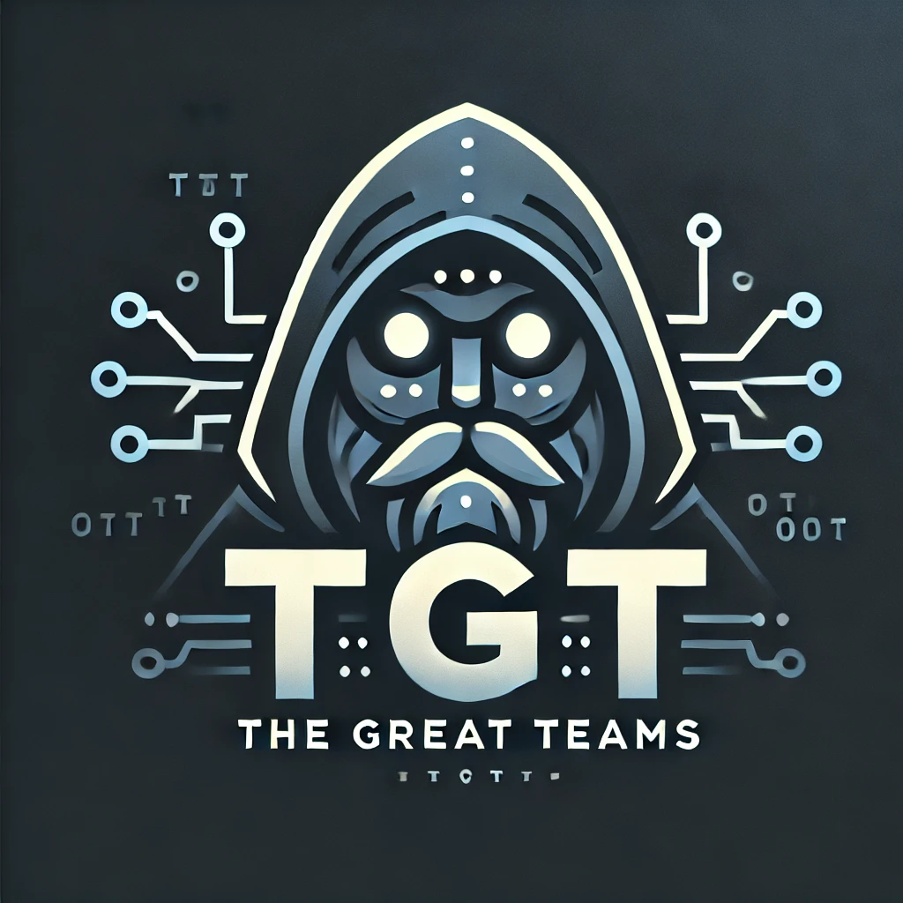

<div align="center">
  

  # WebChat AI
  A Modern AI Chat Interface Using Html, Css, Js And Backend Use Express.js

  [](https://www.gnu.org/licenses/gpl-3.0)
  [](https://github.com/TheGreatTeams)
  [](https://github.com/TheGreatTeams/WebChat-AI/graphs/commit-activity)
  [](https://github.com/TheGreatTeams/WebChat-AI/issues)
</div>

## Overview

WebChat AI is a professional web application providing an intuitive interface for AI interaction. Built with modern web technologies and optimized for performance, it delivers a seamless chat experience in a sophisticated environment.

## Features

- Modern user interface with professional design
- Real-time AI response integration
- Optimized loading states
- Modern theme interface

## Technical Stack

- HTML5
- CSS
- JavaScript
- Bootstrap 5.3.2

## Installation

1. Clone the repository
```bash
git clone https://github.com/TheGreatTeams/WebChat-AI.git
```

2. Navigate to project directory
```bash
cd WebChat-AI
```

3. Configure API endpoint
```javascript
const API_ENDPOINT = 'api/v1/ask';
```

## API Documentation

### Endpoint Specification
- URL: `/api/v1/ask`
- Method: `POST`
- Content-Type: `application/json`

### Request Format
```json
{
  "text": "User input message"
}
```

### Response Format
```json
{
  "result": "AI response message"
}
```

## Configuration

The application can be configured through:

### Core Files
- `web.html` - Main structure
- `styles` section - Visual styling
- `script` section - Application logic

### Customization Options
- Bootstrap class modifications
- Theme customization
- Layout adjustments
- Component additions

## Development

### Setup Process
1. Configure web server
2. Set up API endpoint
3. Deploy application files
4. Test functionality

## Contributing

1. Fork repository
2. Create feature branch
```bash
git checkout -b feature-name
```
3. Commit changes
```bash
git commit -m 'Feature description'
```
4. Push to branch
```bash
git push origin feature-name
```
5. Submit pull request

## License

GNU General Public License v3.0. See [LICENSE](LICENSE) file.

## Resources

- Project Repository: [WebChat-AI](https://github.com/TheGreatTeams/WebChat-AI)
- Issue Tracker: [Issues](https://github.com/TheGreatTeams/WebChat-AI/issues)
- Organization: [TheGreatTeams](https://github.com/TheGreatTeams)

## Support

For support, please open an issue in the GitHub repository.

---

<div align="center">
  Developed by <a href="https://github.com/TheGreatTeams">TheGreatTeams</a>
</div>